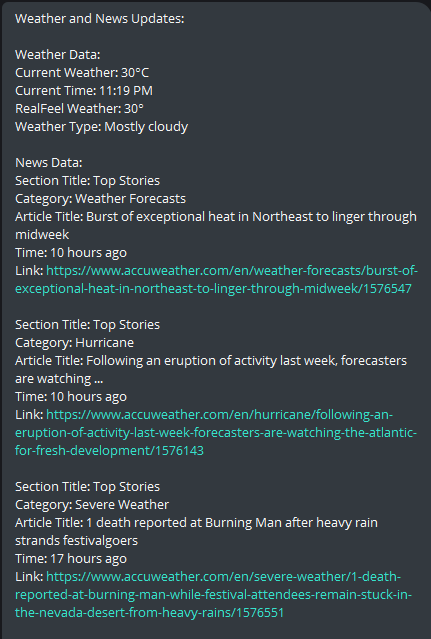
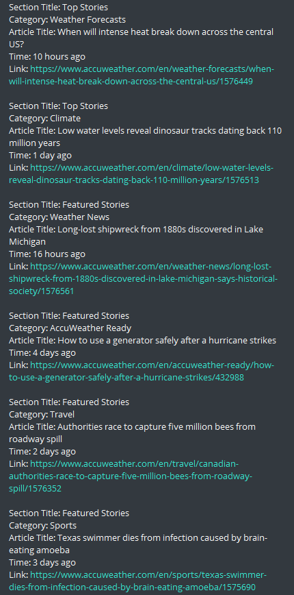

# Weather_Scraper 

This project is a Python script that scrapes weather information from [https://www.accuweather.com](https://www.accuweather.com/) and sends it to a Telegram bot. It uses mainly two libraries. BeautifulSoup for web scraping and Python-telegram-bot library to be able to interact with the telegram bot.

## Features

- Scrapes current weather information from a specified URL.
- Scrapes "Top Stories" and "Featured Stories" sections from the same URL
- Sends the collected data to a Telegram bot to always stay on top of current weather and information.

## Prerequisites

Before you begin, ensure you have met the following requirements:

- Python 3.11
- Required python libraries (included in requirements.txt)

## Setup and Usage

1. Clone this repository (git clone https://github.com/emontes22/Weather_Scraper.git).
2. Nagivate to the project directory.
3. Configure the script:
    - Open `scraper.py` and replace `'Your_user_agent'` with your actual user agent. ([Google user agent](https://www.google.com/search?q=what+is+my+user+agent&oq=what+is+my+user+agent&aqs=chrome..69i57.2459j0j1&sourceid=chrome&ie=UTF-8))
    - Open `tele_bot.py` and replace `'Your_TOKEN_API'` and `'Your_ID'` with your Telegram bot token and chat ID. ([Instructions to create a telegram bot](https://www.google.com/search?q=what+is+my+user+agent&oq=what+is+my+user+agent))
4. Run the script. (`'python tele_bot.py'` or '`python3 tele_bot.py'`)
5. The script will scrape the data and send it to your Telegram bot.

## License

This project is licensed under the MIT License. See the [LICENSE](LICENSE) file for details.